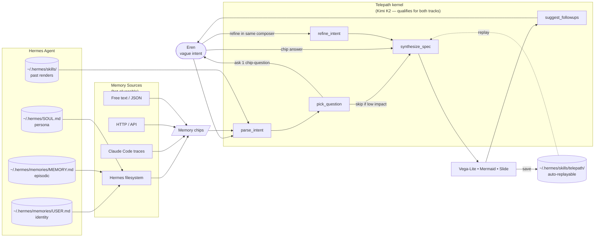

# Telepath — pitch for Hermes Agent Creative Hackathon

> *"It already knew."*

A memory-aware visualizer that reads your Hermes Agent's persistent state, asks the
fewest possible questions, fills the gaps with sensible defaults, and renders a
chart, diagram, or single-screen infographic. The more Hermes knows you, the
quieter Telepath gets.

---

## How it uses Hermes Agent

---

## Why this matters for the Hermes hackathon

| Hackathon criterion | Telepath's wedge |
|---|---|
| **Creativity** | Memory-aware elicitation is a new UX primitive. Every other text-to-viz tool starts cold. Telepath starts warm. |
| **Usefulness** | Solves the universal "blank canvas tax" — vague idea in, polished output out, zero forms. |
| **Presentation** | Cold-start vs. memory-active toggle is the most legible demo split possible. Same prompt, different number of questions. |
| **Kimi fit** | Five distinct Kimi K2 prompts (parse, pick, synth, refine, suggest) — qualifies for the Kimi Track *and* the Main Track. Model name visible on screen. |

### The four layers we treat Hermes as

1. **Persona** — `SOUL.md` shapes tone of generated copy in slides.
2. **Identity** — `memories/USER.md` provides stable user facts (preferred palette, tools, projects).
3. **Episodic** — `memories/MEMORY.md` provides recent context that fades.
4. **Procedural** — `skills/telepath/<slug>/DESCRIPTION.md` lets every render become a reusable skill the agent can replay in any Hermes context (Telegram, CLI, Slack).

### Multi-source grounding

Sources are hot-pluggable. Today supported:

- **Hermes filesystem** (always on)
- **JSON paste** — drop in a `{ chips: [...] }` blob
- **Free text** — paste a paragraph; we sentence-split it
- **HTTP API** — point at any URL with optional bearer token; expects `{ chips: [...] }`
- **Claude Code traces** — Kimi auto-extracts durable facts from `~/.claude/projects/*.jsonl`

The drawer shows live chip counts and last-fetched per source. Toggle any off → the
parse_intent prompt instantly stops grounding from it. This makes the cold/warm
demo concrete and reproducible.

### What gets persisted back to Hermes

Every successful render writes a **Hermes skill** under
`~/.hermes/skills/telepath/<slug>/DESCRIPTION.md` with frontmatter holding the
resolved (intent → spec) pair. Hermes can replay it without Telepath running.

---

## Demo script (≤ 90s)

**0:00 – 0:10** Title card: "It already knew."

**0:10 – 0:30** Toggle "Cold start" on. Ask: *"chart how my research is going."*
Telepath asks one chip question (`Where's your research data sitting?` → `W&B` /
`HuggingFace` / `Spreadsheet`). Click W&B. Bar chart renders.

**0:30 – 0:55** Toggle off. Same ask. Watch the chips on the left rail glow
**one by one** as Kimi consumes them. **Zero questions.** Chart renders, this
time titled with the user's actual project names.

**0:55 – 1:15** Type in same composer: *"add SOTA milestones as annotations."*
Refine flow runs — palette, audience, scope all preserved from memory. New card
stacks below. Click `Save as Hermes skill`. Right rail updates.

**1:15 – 1:30** Open Sources drawer. Click `⤓ From Claude Code`. Pick a project.
Watch new chips appear on the left rail. Re-ask — now even more grounded.

**End card:** *"Five Kimi K2 prompts. One Hermes Agent. Zero blank canvases."*

---

## Tracks

- **Main Track** — eligible (creative-software lane).
- **Kimi Track** — eligible (Kimi K2 powers all five reasoning steps via
  Moonshot OpenAI-compatible API; model name shown in header badge).

## Repo

`/Users/eren/Documents/AI/visualizer_hermes` — Next.js 16, React 19, Tailwind 4,
Vega-Lite v5, Mermaid v11, Kimi K2 (`moonshotai/kimi-k2-0905` via OpenRouter or
direct Moonshot).

## License

MIT.
